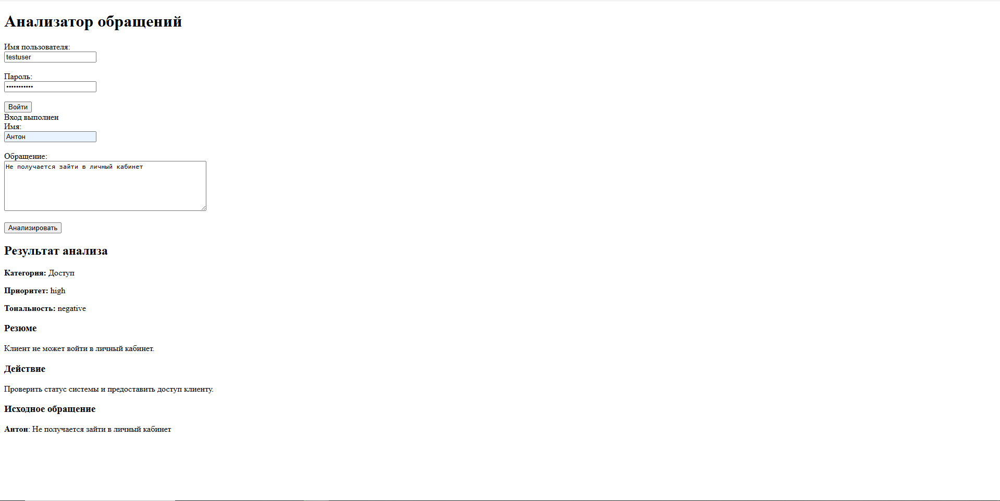
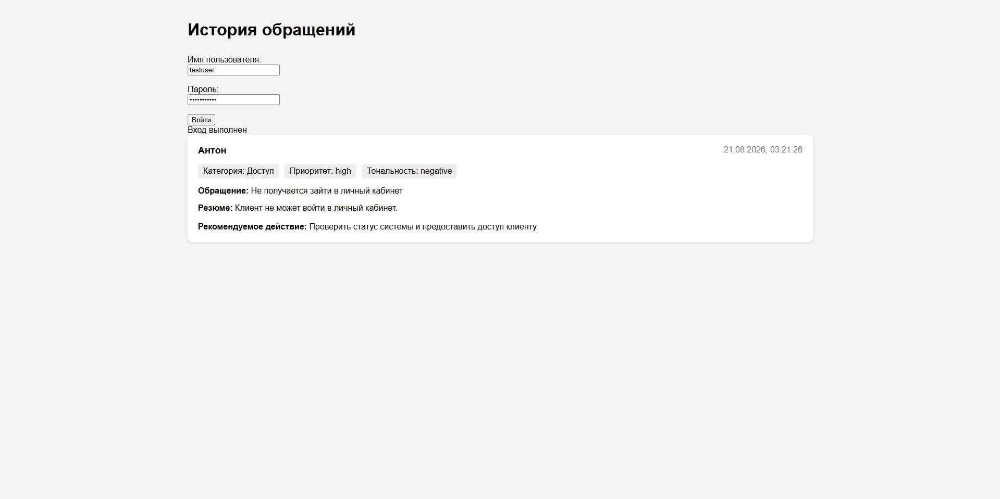
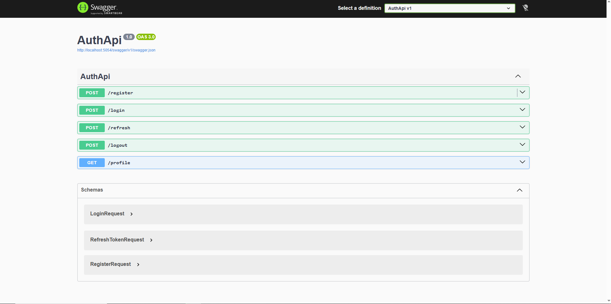
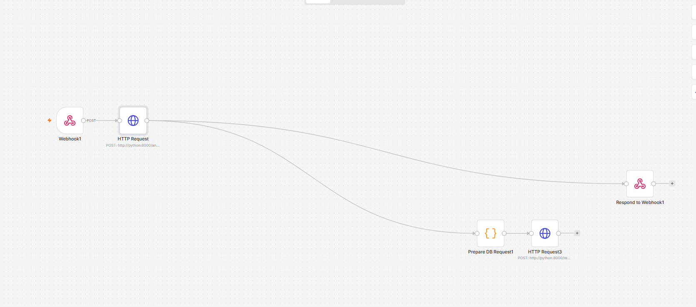

# Request Analyzer

Request Analyzer — система автоматического анализа пользовательских обращений с использованием **Python AI Service**, локальной LLM, RAG-базы знаний и PostgreSQL.

Проект запускается через **Docker Compose** и объединяет:

* Python FastAPI API;
* ASP.NET Core AuthApi;
* n8n workflow automation;
* PostgreSQL;
* Ollama с моделью `qwen3:8b` и `nomic-embed-text`;
* RAG pipeline для работы с базой знаний.

Система принимает обращение пользователя через веб-интерфейс, выполняет AI-анализ с использованием локальной LLM и контекста из базы знаний, определяет категорию, приоритет и тональность, формирует краткое резюме и рекомендуемое действие, после чего сохраняет результат в PostgreSQL.

Проект построен с разделением ответственности между сервисами:

* **Python FastAPI API** принимает и валидирует обращения, выполняет AI-анализ с использованием RAG и локальной LLM, а также предоставляет endpoint для сохранения результатов анализа в PostgreSQL.
* **n8n** используется как слой автоматизации workflow: принимает входящие запросы, вызывает Python API и возвращает результат.
* **AuthApi** отвечает за регистрацию пользователей, JWT-аутентификацию, access/refresh tokens и управление профилем.
* **PostgreSQL** используется для хранения данных обращений, пользователей, refresh tokens и базы знаний.


## Архитектура

```text
Browser
    |
    | POST /webhook/request-analyzer
    v
n8n Workflow
    |
    | POST /analyze-request
    v
Python FastAPI API
    |
    +--> AI Analyzer
    |       |
    |       +--> RAG Search
    |       |      |
    |       |      +--> PostgreSQL + pgvector
    |       |             |
    |       |             +--> knowledge_chunks
    |       |                    |
    |       |                    +--> content
    |       |                    +--> embedding vector(768)
    |       |
    |       +--> Ollama / qwen3:8b
    |
    v
Analysis Result
    |
    +--------------------+
    |                    |
    v                    v
n8n DB Preparation    Respond to Webhook
    |
    | POST /requests
    v
PostgreSQL request_analyzer


Knowledge Base Preparation
    |
    +--> Document Ingestion
    |
    +--> Text Chunking
    |
    +--> Embeddings Generation
    |
    v
PostgreSQL + pgvector


Browser -- login --> AuthApi -- EF Core --> PostgreSQL authapi
```

Основные компоненты:

* **n8n** отвечает за автоматизацию workflow:

  * принимает обращения через Webhook;
  * передаёт данные в Python API;
  * возвращает результат анализа клиенту.

* **Python FastAPI API** является основным AI-сервисом:

  * принимает и валидирует обращения;
  * выполняет AI-анализ;
  * управляет RAG pipeline;
  * получает релевантный контекст из PostgreSQL с использованием pgvector;
  * формирует запрос к локальной LLM;
  * сохраняет результаты анализа.

* **RAG Pipeline** использует PostgreSQL с расширением **pgvector**:

  * документы базы знаний загружаются через ingestion pipeline;
  * текст разбивается на отдельные чанки;
  * для каждого чанка создаются embeddings;
  * embeddings сохраняются в таблицу `knowledge_chunks`;
  * при анализе обращения выполняется vector similarity search;
  * найденные фрагменты добавляются в prompt и передаются локальной LLM как дополнительный контекст для анализа обращения.

* **AuthApi** отвечает за:

  * регистрацию пользователей;
  * login;
  * access/refresh tokens;
  * JWT-проверку;
  * получение профиля пользователя.

* **PostgreSQL** используется для нескольких задач:

  * хранение обращений и результатов анализа;
  * хранение пользователей и refresh tokens;
  * хранение базы знаний и embeddings через pgvector.

* **Docker Compose** объединяет сервисы в единую внутреннюю сеть и управляет порядком запуска контейнеров через healthcheck PostgreSQL.

## Структура репозитория

```text id="8wq3lm"
request-analyzer/

├── authapi/
│   ├── Dockerfile
│   ├── .dockerignore
│   ├── AuthApi.csproj
│   ├── Program.cs
│   ├── Data/
│   ├── Migrations/
│   ├── Models/
│   ├── Services/
│   └── Properties/

├── python/
│   ├── Dockerfile
│   ├── main.py
│   ├── database.py
│   ├── models.py
│   ├── ai/
│   │   └── analyzer.py
│   ├── knowledge/
│   │   ├── chunking.py
│   │   ├── embeddings.py
│   │   ├── ingestion.py
│   │   ├── search.py
│   │   ├── store.py
│   │   ├── documents/
│   │   │   └── support_rules.md
│   │   └── tests/
│   └── requirements.txt

├── n8n/
│   └── request-analyzer.json

├── init-db/
│   ├── 01-create-authapi.sql
│   └── 02-create-knowledge-chunks.sql

├── tests/
│   ├── conftest.py
│   ├── test_analyze.py
│   └── test_requests.py

├── screenshots/

├── docker-compose.yml

├── .gitignore

└── README.md
```

Основные директории:

* **`authapi/`** — ASP.NET Core сервис аутентификации:

  * регистрация пользователей;
  * JWT access/refresh tokens;
  * управление профилем;
  * EF Core migrations.

* **`python/`** — основной AI-сервис проекта:

  * FastAPI API;
  * анализ пользовательских обращений;
  * взаимодействие с локальной LLM;
  * управление RAG pipeline.

* **`python/knowledge/`** — модуль работы с базой знаний:

  * загрузка и обработка документов;
  * разбиение текста на чанки;
  * создание embeddings;
  * сохранение данных в PostgreSQL + pgvector;
  * vector similarity search;
  * получение релевантного контекста для AI-анализа.

* **`n8n/`** — workflow автоматизации:

  * обработка входящих Webhook-запросов;
  * вызов Python API;
  * возврат результата пользователю.

* **`init-db/`** — SQL-скрипты инициализации PostgreSQL:

  * создание базы AuthApi;
  * включение расширения `vector`;
  * создание таблицы `knowledge_chunks` для хранения embeddings.

## Технологический стек

* **C# / ASP.NET Core / .NET 10** — AuthApi сервис;

* **Entity Framework Core 10** — работа с базой данных AuthApi и migrations;

* **PostgreSQL 16** — основное хранилище данных;

* **pgvector** — расширение PostgreSQL для хранения embeddings и vector similarity search;

* **JWT (HS256)** — аутентификация и авторизация пользователей;

* **BCrypt** — безопасное хеширование паролей;

* **Python 3.12** — основной язык AI-сервиса;

* **FastAPI** — API для обработки обращений и интеграции компонентов;

* **Uvicorn** — ASGI сервер;

* **Pydantic** — валидация входных данных;

* **SQLAlchemy** — работа Python-сервиса с PostgreSQL;

* **RAG Pipeline**:

  * document ingestion;
  * text chunking;
  * embeddings generation;
  * vector storage;
  * semantic search;

* **Ollama** — локальный inference сервер;

* **Qwen3:8B** — локальная LLM для анализа обращений;

* **nomic-embed-text** — embedding-модель, используется для преобразования пользовательских запросов и chunks базы знаний в векторы размерностью 768 для semantic search через pgvector.

* **n8n** — workflow automation и интеграция сервисов;

* **Swagger / OpenAPI** — документация AuthApi;

* **Docker и Docker Compose** — контейнеризация и запуск всей системы;

* **pytest** — автоматизированное тестирование Python-компонентов.

## Возможности

* регистрация пользователя и вход через AuthApi;
* выдача, обновление и отзыв access/refresh tokens;
* защищённый профиль пользователя через JWT;
* HTML-интерфейс для отправки и просмотра обращений;
* передача JWT из браузера через n8n workflow;
* автоматический анализ пользовательских обращений с использованием локальной LLM;
* определение категории, приоритета и тональности обращения;
* формирование краткого резюме и рекомендуемого действия;
* использование RAG-поиска для анализа обращений с учётом базы знаний;
* хранение и поиск документов через PostgreSQL + pgvector;
* получение релевантного контекста из базы знаний перед генерацией ответа;
* сохранение обращений и результатов AI-анализа в PostgreSQL;
* просмотр истории обращений;
* автоматизация обработки запросов через n8n;
* модульная архитектура AI-компонентов на Python;
* проверочные сценарии для AI pipeline, RAG-компонентов и API через pytest.


## Запуск через Docker Compose

### Prerequisites

Для запуска нужны:

* Docker Desktop с Docker Compose;
* Ollama, запущенная на хост-системе;
* `qwen3:8b` — генеративная LLM;
* `nomic-embed-text` — embedding-модель для RAG.

Загрузка модели:

```bash
ollama pull qwen3:8b
ollama pull nomic-embed-text
```

Python AI Service обращается к Ollama через:

```text
http://host.docker.internal:11434
```

Этот адрес используется внутри AI pipeline для выполнения анализа через локальную LLM.

### Переменные окружения

Создайте локальный `.env` в корне репозитория. Реальные значения не должны попадать в Git.

Необходимая переменная:

```env
JWT_SECRET_KEY=<локальный signing key>
```

Compose также поддерживает следующие переменные с безопасными значениями по умолчанию:

```env
JWT_ISSUER=AuthApi
JWT_AUDIENCE=AuthApiClient
JWT_ALGORITHM=HS256
```

`JWT_SECRET_KEY` передаётся Python как `JWT_SECRET_KEY`, а AuthApi как `Jwt__Key`.

Ключ должен быть одинаковым для обоих сервисов.

### Запуск

```bash
docker compose up --build
```

Или в фоне:

```bash
docker compose up -d --build
```

Остановка без удаления данных:

```bash
docker compose stop
```

PostgreSQL запускается с healthcheck:

```text
pg_isready -U analyzer -d request_analyzer
```

Python и AuthApi зависят от `postgres` с condition `service_healthy`, поэтому стартуют после готовности PostgreSQL.

При запуске AuthApi вызывает `Database.Migrate()` и автоматически применяет отсутствующие EF Core migrations к базе `authapi`.

Инициализация RAG-хранилища выполняется через SQL-скрипт:

```text
init-db/02-create-knowledge-chunks.sql
```

Скрипт:

* включает расширение PostgreSQL `vector`;
* создаёт таблицу `knowledge_chunks`;
* подготавливает vector storage для embeddings.

### Сервисы и порты

| Сервис     | Назначение                          | Адрес                               |
| ---------- | ----------------------------------- | ----------------------------------- |
| Python     | FastAPI, AI Service и веб-интерфейс | `http://localhost:8000`             |
| AuthApi    | Регистрация, JWT и профиль          | `http://localhost:5054`             |
| n8n        | Workflow automation                 | `http://localhost:5678`             |
| PostgreSQL | Внутренняя база данных              | `postgres:5432` внутри Compose-сети |

PostgreSQL не публикуется отдельным host-портом в текущем Compose; сервисы подключаются к нему по имени `postgres`.


## AuthApi

Исходники находятся в `authapi/`.

AuthApi — отдельный ASP.NET Core сервис, отвечающий за управление пользователями и безопасность доступа к системе.

Сервис использует:

* ASP.NET Core;
* Entity Framework Core;
* PostgreSQL;
* Npgsql;
* BCrypt;
* JWT Bearer Authentication.

### Endpoints

| Метод  | Endpoint    | Назначение                                               |
| ------ | ----------- | -------------------------------------------------------- |
| `POST` | `/register` | Регистрация пользователя                                 |
| `POST` | `/login`    | Проверка credentials и выдача access/refresh tokens      |
| `POST` | `/refresh`  | Выдача нового access token по refresh token              |
| `POST` | `/logout`   | Отзыв refresh token                                      |
| `GET`  | `/profile`  | Профиль текущего JWT-пользователя; требует authorization |

JWT использует значения:

* `Jwt:Key`;
* `Jwt:Issuer`;
* `Jwt:Audience`.

Параметры передаются в контейнер через environment variables.

Access token содержит identity claims пользователя и проверяется по:

* issuer;
* audience;
* сроку действия;
* signing key.

EF Core migrations находятся в:

```text
authapi/Migrations/
```

При запуске приложения они автоматически применяются к базе `authapi` через:

```csharp
Database.Migrate()
```

### Swagger / OpenAPI

AuthApi публикует Swagger UI и OpenAPI JSON через Swashbuckle:

* Swagger UI: `http://localhost:5054/swagger`;
* OpenAPI JSON: `http://localhost:5054/swagger/v1/swagger.json`.

## Screenshots

### Request Analyzer Main Page



### Request History



### AuthApi Swagger UI



### n8n Workflow



## Request Analyzer

Python AI Service находится в `python/` и является основным сервисом обработки пользовательских обращений.

Сервис запускается через Uvicorn на порту `8000` и отвечает за:

* обработку HTTP-запросов;
* анализ обращений;
* взаимодействие с локальной LLM;
* работу RAG pipeline;
* сохранение результатов в PostgreSQL.

Структура AI-компонентов:

```text id="rq5p3s"
python/

├── ai/
│   └── analyzer.py

└── knowledge/
    ├── chunking.py
    ├── embeddings.py
    ├── ingestion.py
    ├── search.py
    ├── store.py
    └── documents/
```

### AI Pipeline

Основной процесс анализа:

```text id="9l5q6f"
User Request

    |
    v

Python FastAPI

    |
    v

AI Analyzer

    |
    +--> RAG Search
    |       |
    |       v
    |   PostgreSQL + pgvector
    |       |
    |       v
    |   Relevant Knowledge Context
    |
    v

Prompt + Context

    |
    v

Ollama / qwen3:8b

    |
    v

Analysis Result
```

Перед генерацией ответа система выполняет поиск релевантной информации в базе знаний. Найденные фрагменты документов используются как дополнительный контекст для LLM.

### Endpoints

| Метод | Endpoint | Назначение |
| ------ | -------- | ---------- |
| `GET` | `/` | Главная HTML-страница с login и формой обращения |
| `POST` | `/analyze-request` | RAG-поиск, анализ обращения через LLM и возврат результата |
| `POST` | `/requests` | Сохранение результата анализа в PostgreSQL; используется workflow |
| `GET` | `/requests` | Возвращает историю обращений; требует Bearer JWT |
| `GET` | `/requests-page` | HTML-страница истории с login в браузере |
| `POST` | `/knowledge/search` | Поиск релевантных фрагментов в базе знаний |                       |

На главной странице браузер получает access token через:

```text id="l7xq0f"
POST http://localhost:5054/login
```

Токен хранится только в памяти JavaScript и используется для авторизованных запросов.

n8n получает обращение через Webhook, передаёт данные в Python API и возвращает результат пользователю.

# Обработка ошибок и валидация

Python API выполняет валидацию входных данных и обрабатывает ошибки на нескольких уровнях.

**Валидация входных данных:**

* `name` — от 1 до 100 символов;
* `message` — от 1 до 5000 символов;
* отсутствующие обязательные поля обрабатываются через Pydantic;
* значения, состоящие только из пробелов, отклоняются до запуска AI pipeline.

Для некорректных входных данных FastAPI/Pydantic возвращает `422 Unprocessable Entity`, а дополнительные проверки endpoint возвращают соответствующие ошибки клиента.

**Обработка ошибок AI pipeline:**

* ошибки выполнения RAG и PostgreSQL перехватываются и логируются;
* ошибки подключения к Ollama логируются;
* невалидный JSON от LLM обрабатывается отдельно и возвращает `502 Bad Gateway`;
* остальные необработанные исключения пробрасываются в FastAPI и приводят к `500 Internal Server Error`.

**JWT-аутентификация:**

JWT проверяется по:

* наличию токена;
* алгоритму подписи;
* секретному ключу;
* `issuer`;
* `audience`;
* сроку действия;
* наличию идентификатора пользователя в claims.

Некорректные и просроченные токены возвращают `401 Unauthorized`.

**Логирование:**

Для логирования используется стандартный Python `logging` с `logger.exception()` для ошибок, требующих traceback.

Логи приложения не записываются в отдельные файлы. Они выводятся в stdout/stderr Python-контейнера и доступны через Docker:

```text
docker logs request-analyzer-python
```

Проверены сценарии ошибок PostgreSQL, RAG, Ollama, невалидного JSON от LLM, JWT и некорректных входных данных.


### RAG Pipeline

Модуль `python/knowledge/` отвечает за работу с базой знаний:

* `chunking.py` — разбиение документов на отдельные фрагменты;
* `embeddings.py` — создание embeddings для текстовых данных;
* `ingestion.py` — загрузка документов в pipeline;
* `store.py` — сохранение данных в PostgreSQL + pgvector;
* `search.py` — поиск похожих фрагментов по embedding similarity.

Vector storage использует PostgreSQL расширение `pgvector`.

Основная таблица:

```text id="4q8v6s"
knowledge_chunks

- id
- document_name
- chunk_index
- content
- embedding vector(768)
- created_at
```

Python подключается к базе `request_analyzer` через внутреннее имя Docker-сервиса:

```text id="3b1b8x"
postgres
```

`POST /requests` используется n8n для сохранения результата анализа. JWT-защита применяется к `GET /requests`.

## n8n

Workflow находится в:

```text
n8n/request-analyzer.json
```

n8n используется как слой автоматизации и интеграции между пользовательским интерфейсом и Python AI Service.

Основной workflow:

```text id="5p8x4v"
Webhook POST /webhook/request-analyzer

        |
        v

HTTP Request POST /analyze-request

        |
        v

Python FastAPI AI Service

        |
        v

Analysis Result

        |
        v

HTTP Request POST /requests

        |
        v

Respond to Webhook
```

Основные задачи n8n:

* получение входящих обращений через Webhook;
* передача данных в Python API;
* прокидывание JWT заголовка;
* получение результата AI-анализа;
* сохранение результата через Python API;
* возврат ответа пользователю.

AI-анализ выполняется внутри Python сервиса:

```text id="7czqxn"
Python API
    |
    +--> RAG Pipeline
    |
    +--> PostgreSQL + pgvector
    |
    +--> Ollama / qwen3:8b
```

Webhook принимает JSON с полями:

```json id="6qz2j3"
{
  "name": "User",
  "message": "Request text"
}
```

Для передачи авторизации используется исходный заголовок:

```text id="jj7q1s"
$json.headers.authorization
```

После получения результата workflow возвращает пользователю JSON с результатами анализа:

* category;
* priority;
* sentiment;
* summary;
* action.

## База данных

Проект использует один контейнер PostgreSQL, внутри которого находятся отдельные базы данных для разных сервисов:

* `request_analyzer` — данные Python AI Service и RAG pipeline;
* `authapi` — пользователи и данные аутентификации AuthApi.

### request_analyzer

Используется Python сервисом для хранения обращений и базы знаний.

Основные таблицы:

**`requests`**

Хранит пользовательские обращения и результаты AI-анализа:

* имя пользователя;
* исходный текст обращения;
* метрики текста;
* категория;
* приоритет;
* тональность;
* краткое резюме;
* рекомендуемое действие.

**`knowledge_chunks`**

Используется RAG pipeline для хранения базы знаний.

Таблица содержит:

* имя исходного документа;
* индекс чанка;
* текстовый фрагмент;
* embedding в формате `vector(768)`;
* дату создания.

PostgreSQL использует расширение `pgvector`:

```sql
CREATE EXTENSION IF NOT EXISTS vector;
```

Embeddings используются для выполнения vector similarity search при поиске релевантного контекста для AI-анализа.

### authapi

Используется AuthApi для управления пользователями.

Основные таблицы:

**`Users`**

Хранит:

* имя пользователя;
* хеш пароля;
* данные пользователя.

**`RefreshTokens`**

Хранит:

* refresh tokens;
* срок действия;
* статус отзыва;
* связь с пользователем.

**`__EFMigrationsHistory`**

История применённых EF Core migrations.

### Docker PostgreSQL

PostgreSQL доступен сервисам внутри Compose-сети по адресу:

```text
postgres:5432
```

Инициализация базы знаний выполняется через:

```text
init-db/02-create-knowledge-chunks.sql
```

Скрипт включает pgvector и создаёт структуру хранения embeddings.

## Разработка и тестирование

Python-зависимости находятся в:

```text id="6kq3d2"
python/requirements.txt
```

Для локальной установки:

```bash id="n4sl7k"
python -m pip install -r python/requirements.txt
```

Запуск pytest:

```bash id="d8m2vz"
python -m pytest -q
```

### Проверка AI и RAG компонентов

Проверочные сценарии находятся в:

```text id="5j7m2p"
python/knowledge/tests/
```

Они используются для проверки работы основных компонентов RAG pipeline:

* разбиение документов на чанки;
* создание embeddings;
* загрузка документов через ingestion pipeline;
* сохранение данных в vector storage;
* поиск релевантных фрагментов из базы знаний.

### Проверка Python API

API-сценарии находятся в:

```text id="1x7s4a"
tests/
```

Они проверяют основные HTTP endpoints Python сервиса:

* анализ обращений;
* сохранение запросов;
* получение истории;
* работу JWT-защищённых endpoints.

### Проверка Docker-конфигурации

Для проверки итоговой Compose-конфигурации:

```bash id="x3z8qk"
docker compose config
```

Сборка AuthApi через Compose:

```bash id="r8n3dw"
docker compose build authapi
```

Полная сборка и запуск всех сервисов:

```bash id="7m1v9a"
docker compose up --build
```

## Безопасность

* Не добавляйте в Git:

  * `.env`;
  * реальные JWT signing keys;
  * access tokens;
  * refresh tokens;
  * пароли от внешних сервисов.

* Не переносите локальные файлы конфигурации с секретами, включая `appsettings.Development.json`.

* Не используйте реальные токены в тестовых файлах или примерах запросов.

* `JWT_SECRET_KEY` должен задаваться через `.env` или внешнюю переменную окружения.

* Для AuthApi ключ передаётся как:

```text id="myh9qz"
Jwt__Key
```

* Для Python AI Service ключ передаётся как:

```text id="0q6zpm"
JWT_SECRET_KEY
```

* JWT проверяется по:

  * алгоритму HS256;
  * issuer;
  * audience;
  * сроку действия;
  * подписи.

* PostgreSQL доступен сервисам только внутри Docker Compose-сети:

```text id="4my9as"
postgres:5432
```

* RAG база знаний также должна рассматриваться как защищаемый источник данных:

  * не храните в документах секреты и персональные данные;
  * контролируйте содержимое загружаемых документов;
  * ограничивайте доступ к таблице `knowledge_chunks`.

* Embeddings, сохранённые в PostgreSQL + pgvector, являются частью базы знаний и должны защищаться вместе с исходными документами.

* Для production-развёртывания рекомендуется использовать внешний secret manager и не хранить секреты в файлах проекта.

## Docker Compose

Docker Compose является основным способом запуска проекта.

Compose собирает и запускает все основные сервисы системы:

* `python` — FastAPI AI Service с RAG pipeline;
* `authapi` — ASP.NET Core сервис аутентификации;
* `postgres` — PostgreSQL с pgvector для хранения данных и embeddings;
* `n8n` — workflow automation.

При запуске создаётся внутренняя Docker Compose сеть, подключаются необходимые volumes и управляется порядок старта сервисов.

PostgreSQL запускается с healthcheck, после чего:

* AuthApi применяет EF Core migrations к базе `authapi`;
* Python подключается к базе `request_analyzer`;
* RAG pipeline использует PostgreSQL + pgvector для работы с `knowledge_chunks`.

Основные команды:

```bash id="v8sm2j"
docker compose up --build
```

Запуск в фоне:

```bash id="8y5b8p"
docker compose up -d --build
```

Остановка контейнеров без удаления данных:

```bash id="z7v4qa"
docker compose stop
```

Проверка итоговой конфигурации:

```bash id="m9x6fs"
docker compose config
```

