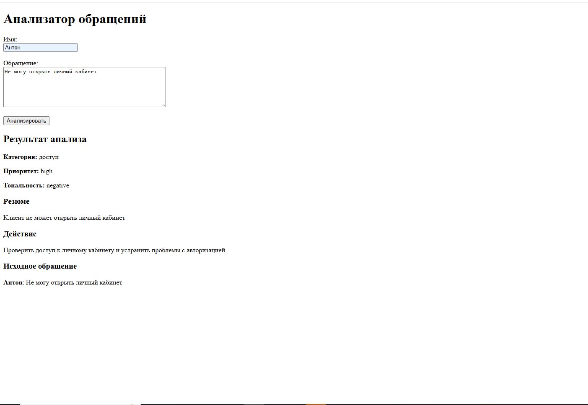
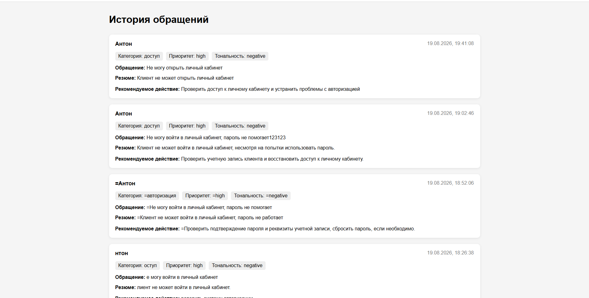

# Request Analyzer

Сервис для автоматического анализа обращений пользователей с использованием **n8n и локальной LLM Qwen3:8B**.

Пользователь отправляет имя и текст обращения. Workflow в n8n принимает запрос через Webhook, передаёт обращение на AI-анализ, получает результат, сохраняет его вместе с исходными данными в PostgreSQL и возвращает пользователю результат.

AI определяет категорию, приоритет и тональность обращения, формирует краткое резюме и рекомендуемое действие.

## Возможности

* Приём обращений пользователей через Webhook
* Автоматизация обработки обращений в n8n
* AI-анализ текста с использованием Qwen3:8B
* Запуск локальной LLM через Ollama
* Определение категории обращения
* Определение приоритета
* Определение тональности
* Формирование краткого резюме
* Формирование рекомендуемого действия
* Валидация и обработка данных
* Сохранение обращений и результатов анализа в PostgreSQL
* Просмотр истории обращений
* REST API на FastAPI
* Тестирование API с помощью pytest
* Запуск сервисов через Docker Compose

## Архитектура

                         ┌──────────────────┐
                         │    Пользователь  │
                         └────────┬─────────┘
                                  │
                                  ▼
                         ┌──────────────────┐
                         │   Web UI         │
                         │ HTML / JavaScript│
                         └────────┬─────────┘
                                  │
                                  │ POST
                                  ▼
                         ┌──────────────────┐
                         │   n8n Webhook    │
                         └────────┬─────────┘
                                  │
                                  ▼
                         ┌──────────────────┐
                         │ Подготовка JSON  │
                         │ / валидация      │
                         └────────┬─────────┘
                                  │
                    ┌─────────────┴─────────────┐
                    │                           │
                    ▼                           ▼
          ┌──────────────────┐        ┌──────────────────┐
          │ Исходные данные  │        │    AI-анализ     │
          │ name + message   │        │ Ollama + Qwen3:8B│
          └────────┬─────────┘        └────────┬─────────┘
                   │                           │
                   │                           ▼
                   │                  ┌──────────────────┐
                   │                  │ Результат AI     │
                   │                  │ category         │
                   │                  │ priority         │
                   │                  │ sentiment        │
                   │                  │ summary          │
                   │                  │ action            │
                   │                  └────────┬─────────┘
                   │                           │
                   └─────────────┬─────────────┘
                                 ▼
                         ┌──────────────────┐
                         │      Merge       │
                         └────────┬─────────┘
                                  │
                                  ▼
                         ┌──────────────────┐
                         │     FastAPI      │
                         └────────┬─────────┘
                                  │
                                  ▼
                         ┌──────────────────┐
                         │   PostgreSQL     │
                         └──────────────────┘
                                  │
                                  │
                                  ▼
                         ┌──────────────────┐
                         │ Respond Webhook  │
                         └────────┬─────────┘
                                  │
                                  ▼
                         ┌──────────────────┐
                         │    Пользователь  │
                         └──────────────────┘

n8n используется как основной слой автоматизации и оркестрации workflow.

FastAPI отвечает за backend API и взаимодействие с PostgreSQL.

Ollama используется для локального запуска модели **Qwen3:8B**, которая выполняет анализ естественного языка.

## AI

Для анализа обращений используется локальная LLM **Qwen3:8B**, запущенная через **Ollama**.

Модель получает текст обращения и формирует результат анализа:

```text
category
priority
sentiment
summary
action
```

AI используется для:

* определения категории обращения;
* определения приоритета;
* анализа тональности;
* формирования краткого резюме;
* рекомендации дальнейшего действия.

Интеграция AI выполняется через n8n. После получения результата он объединяется с исходными данными обращения и передаётся дальше по workflow для сохранения в PostgreSQL.

Использование локальной модели позволяет выполнять анализ без передачи текста обращений во внешний облачный AI-сервис.

## Интерфейс

### Анализ обращений



### История обращений



### n8n Workflow


## Технологии

* Python 3.12
* FastAPI
* Pydantic
* SQLAlchemy
* PostgreSQL 16
* n8n
* Ollama
* Qwen3:8B
* Docker
* Docker Compose
* HTML / CSS / JavaScript
* pytest

## API

### GET `/`

Основная страница анализатора обращений.

### POST `/analyze`

Принимает обращение и выполняет базовую обработку входных данных.

### POST `/requests`

Сохраняет обращение и результат анализа в PostgreSQL.

### GET `/requests`

Возвращает список сохранённых обращений.

### GET `/requests-page`

Веб-страница с историей обращений.

## Запуск

Для запуска проекта требуется Docker Desktop и Ollama.

### 1. Установка Ollama

AI-анализ выполняется локально через Ollama, запущенную непосредственно на Windows.

После установки загрузите модель Qwen3:8B:

```bash
ollama pull qwen3:8b
```

Проверить наличие модели:

```bash
ollama list
```

Ollama должна быть запущена во время работы проекта, так как n8n обращается к ней для выполнения AI-анализа.

### 2. Адрес Ollama для n8n

Поскольку n8n работает внутри Docker-контейнера, а Ollama запущена на Windows, для обращения к Ollama из n8n используется следующий адрес:

```text
http://host.docker.internal:11434/api/generate
```

Этот адрес необходимо указать в HTTP Request node в n8n.

`host.docker.internal` позволяет Docker-контейнеру обращаться к сервисам, запущенным на хост-системе.

### 3. Клонирование репозитория

```bash
git clone https://github.com/fromthedream/request-analyzer.git
cd request-analyzer
```

### 4. Запуск проекта

Запустить контейнеры через Docker Compose:

```bash
docker compose up -d --build
```

После запуска доступны:

* Анализатор: `http://localhost:8000`
* История обращений: `http://localhost:8000/requests-page`
* FastAPI Swagger: `http://localhost:8000/docs`
* n8n: `http://localhost:5678`

### 5. Остановка проекта

Для остановки контейнеров:

```bash
docker compose down
```

Чтобы снова запустить проект после остановки:

```bash
docker compose up -d
```


## Структура проекта

```text
request-analyzer/
├── python/
│   ├── main.py
│   ├── database.py
│   ├── models.py
│   ├── requirements.txt
│   └── Dockerfile
├── tests/
│   ├── conftest.py
│   ├── test_analyze.py
│   └── test_requests.py
├── screenshots/
│   ├── Analyzer.png
│   ├── history.png
│   └── n8n-workflow.png
├── docker-compose.yml
└── README.md
```

## Пример результата

### Вход

```text
Имя: Антон

Обращение:
Не могу войти в личный кабинет, пароль не помогает
```

### Результат

```json
{
  "category": "авторизация",
  "priority": "high",
  "sentiment": "negative",
  "summary": "Клиент не может войти в личный кабинет, пароль не работает",
  "action": "Проверить учетную запись клиента и сбросить пароль."
}
```

## Тестирование

Для API написаны тесты с использованием pytest.

Запуск:

```bash
pytest
```

Тесты проверяют:

* обработку входных данных;
* создание обращения;
* получение истории обращений;
* обязательность полей API.

## Что демонстрирует проект

Проект демонстрирует практическое использование **n8n для автоматизации workflow с AI**, а также навыки:

* построения интеграционных workflow;
* работы с Webhook и HTTP API;
* работы с JSON и структурированными данными;
* интеграции локальных LLM через Ollama;
* обработки и валидации данных;
* работы с PostgreSQL;
* разработки REST API;
* контейнеризации приложений;
* тестирования API;
* разделения ответственности между компонентами системы.
